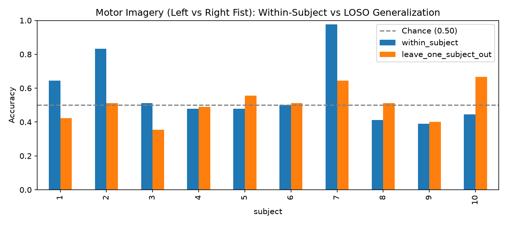

 # Motor-Imagery BCI Baseline (CSP + LDA)

Decoding imagined left- vs. right-fist movement from 64-channel EEG signals using the **PhysioNet EEGMMI dataset** across 10 subjects.

---

##  Methodology

1. **Preprocessing & Pre-filtering:**
   - Bandpass filtered between **8.0–30.0 Hz** ($\mu$ and $\beta$ motor bands).
   - Epoched from $t = 1.0\text{s}$ to $4.0\text{s}$ relative to cue onset (45 trials per subject across runs 4, 8, and 12).
2. **Feature Extraction & Classification:**
   - **Common Spatial Patterns (CSP):** 4 spatial filter components with Ledoit-Wolf covariance regularization.
   - **Linear Discriminant Analysis (LDA):** Classifies spatial power features into left vs. right fist motor imagery.
3. **Cross-Validation Benchmarks:**
   - **Within-Subject:** 10 random 80/20 train/test splits per subject.
   - **Leave-One-Subject-Out (LOSO):** Strict cross-subject evaluation training on 9 subjects and testing on the unseen 10th subject.

---

##  Results

| Metric | Within-Subject Mean | Leave-One-Subject-Out (LOSO) Mean |
| :--- | :---: | :---: |
| **Accuracy** | **56.7%** | **50.7%** (Chance: 50.0%) |

*Individual performance varies significantly: Subject 7 achieves **97.8%** within-subject, whereas LOSO drops to chance level across subjects.*



---

##  Key Takeaway & Discussion

Classic CSP spatial filters extract highly personalized spatial topographies over the sensorimotor cortex ($C3$/$C4$). While individual subjects show strong class separability (e.g., Subject 7 at **97.8%**), the raw spatial patterns fail to generalize across unseen subjects without **domain adaptation**, **Riemannian manifold alignment**, or **subject-invariant feature representations**.

---

##  Quick Start 

1. **Activate Environment:**
   ```bash
   conda activate sam40
